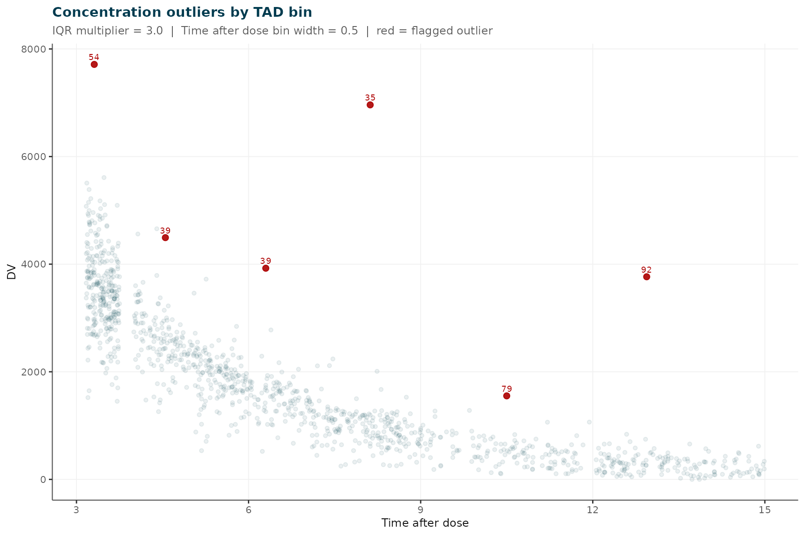
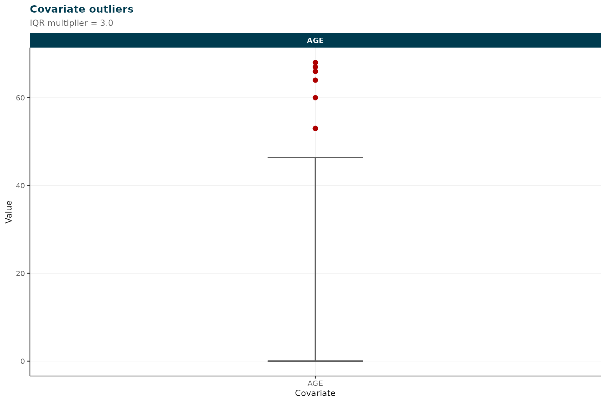
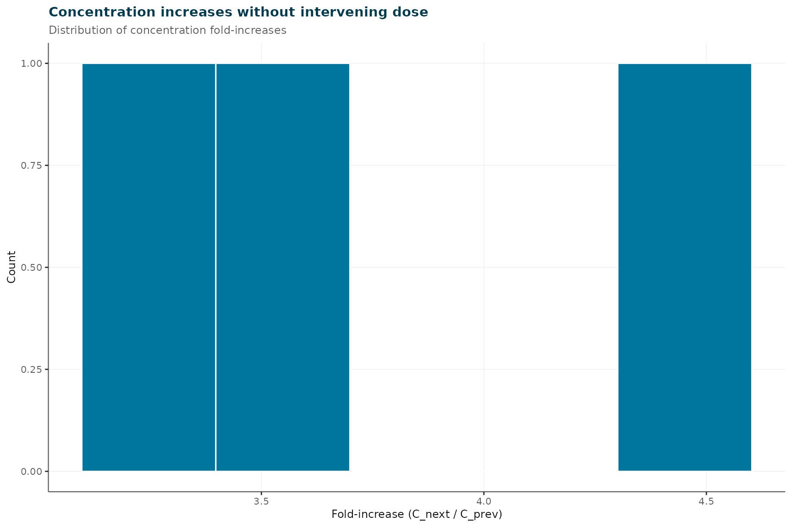

# Simulated Busulfan PK: Part 1 — Gross QC and Exclusion Criteria

## Overview

This vignette covers **Phase 1** of an `irxclean` analysis:
model-independent data screening before a base NONMEM model is fitted.
It walks through:

- Inspecting the simulated busulfan dataset (`busulfan_sim`)
- Gross data quality screening with
  [`assess_data_quality()`](https://insightrx.github.io/irxclean/reference/assess_data_quality.md)
- Investigating covariate anomalies that IQR-based screening misses
- Applying structured exclusion criteria with
  [`apply_exclusion_criteria()`](https://insightrx.github.io/irxclean/reference/apply_exclusion_criteria.md)
- Saving the cleaned, analysis-ready dataset for **Part 2**

> **Part 2** (`busulfan_pt2_modelbased_cleaning`) picks up from the
> output of this vignette and demonstrates NONMEM-based iterative CWRES
> outlier removal. Run this vignette first and save
> `busulfan_pt1_ready.csv` before proceeding.

### Dataset and intentional errors

The dataset (`busulfan_sim`) was generated with **PKPDsim** using a
two-compartment IV busulfan population PK model (ADVAN3 TRANS4,
allometric FFM scaling, maturation, time-varying CL, IIV + IOV). 100
patients (80 paediatric, 20 adult) each received 4 MAP-adapted doses,
with 4 TDM samples per dose (1,200 observations total).

The following intentional errors were introduced:

| FLAG bit | Error type | Count |
|----|----|----|
| 1 | Covariate weight: decimal-place shift (e.g. 22.0 kg -\> 2.2 kg) | 1 patient |
| 2 | Concentration IQR outlier (\>3\*IQR above Q3 per TAD bin) | 2 observations |
| 4 | Timing error (+/- 5, 10, 30, or 60 minutes from true time) | 10 observations |
| 8 | Concentration magnitude error (multipliers 0.25–1.75x) | 10 observations |

------------------------------------------------------------------------

## 1. Inspect the dataset

``` r

cat(sprintf(
  "Patients: %d  |  Rows: %d  |  Observations: %d\n",
  length(unique(busulfan_sim$ID)), nrow(busulfan_sim), sum(busulfan_sim$EVID == 0)
))
#> Patients: 100  |  Rows: 1600  |  Observations: 1200
```

``` r

err_obs <- busulfan_sim[busulfan_sim$FLAG > 0 & busulfan_sim$EVID == 0,
               c("ID", "TIME", "DV", "FLAG", "FLAG_LABEL")]
cat("Flagged observations (ground truth):\n")
#> Flagged observations (ground truth):
print(err_obs[order(err_obs$FLAG, err_obs$ID), ])
#>      ID     TIME        DV FLAG       FLAG_LABEL
#> 1202 76  3.20000 2216.8093    1 covariate_weight
#> 1203 76  4.43000 1259.3036    1 covariate_weight
#> 1204 76  8.58000  252.9989    1 covariate_weight
#> 1205 76  9.23000  184.1580    1 covariate_weight
#> 1207 76 27.61000 4062.5074    1 covariate_weight
#> 1208 76 28.70000 2597.1720    1 covariate_weight
#> 1209 76 31.38000  899.3427    1 covariate_weight
#> 1210 76 37.97000   70.3334    1 covariate_weight
#> 1212 76 51.74000 3574.7893    1 covariate_weight
#> 1213 76 53.72000 1604.0418    1 covariate_weight
#> 1214 76 54.17000 1344.3210    1 covariate_weight
#> 1215 76 60.21000  127.1840    1 covariate_weight
#> 548  35  8.12000 6960.6921    2 conc_iqr_outlier
#> 1466 92 36.94000 3766.0920    2 conc_iqr_outlier
#> 223  14 61.58667  115.7197    4     timing_10min
#> 357  23 13.71000   71.4174    4     timing_30min
#> 762  48 37.25000  328.3775    4     timing_30min
#> 841  53 30.63667 1199.1323    4      timing_5min
#> 1114 70 38.27333  253.0690    4     timing_10min
#> 1239 78 28.46000 3375.0725    4     timing_60min
#> 1279 80 60.35000  119.3422    4     timing_60min
#> 1372 86 51.42333 2761.5047    4      timing_5min
#> 1412 89  8.31000 1671.2129    4     timing_30min
#> 1503 94 59.46000  514.1154    4     timing_60min
#> 179  12  5.18000  534.3144    8  magnitude_0.25x
#> 200  13 28.35000 1532.0964    8  magnitude_0.60x
#> 277  18 10.40000  104.0891    8  magnitude_0.40x
#> 287  18 60.54000  157.6999    8  magnitude_1.05x
#> 378  24 37.71000  198.8850    8  magnitude_0.95x
#> 612  39  6.30000 3924.9722    8  magnitude_1.40x
#> 620  39 51.45000 4853.0208    8  magnitude_1.60x
#> 821  52  9.64000  526.2569    8  magnitude_1.20x
#> 855  54 27.31000 7712.7429    8  magnitude_1.75x
#> 1224 77 29.97000 1504.1938    8  magnitude_0.80x
```

The `FLAG` and `FLAG_LABEL` columns record the ground-truth errors
introduced during simulation. In a real analysis these columns would not
exist; they are shown here to let you assess how well each screening
method performs.

------------------------------------------------------------------------

## 2. Concentration vs. time-after-dose

Visualising the raw concentration data is the first step in any PK
cleaning workflow. Plotting DV against both time-after-dose (TAD) and
absolute time lets you spot structurally implausible values before any
model is fitted.

``` r

ggplot2::ggplot() +
  .pk_layers("TAD", "Time after dose (h)", c(3, 6, 9, 12, 15)) +
  ggplot2::labs(
    title    = "DV vs. time after dose",
    subtitle = sprintf("%d patients | %d obs | %d flagged",
                       dplyr::n_distinct(obs$ID), nrow(obs),
                       sum(obs$error_type != "Clean"))
  )
```


DV vs. time after dose (TAD). TDM samples drawn randomly from four
post-infusion windows (10-45 min, 1-3 h, 3-6 h, 6-12 h after end of the
3-h infusion).

``` r

dose_times <- unique(busulfan_sim$TIME[busulfan_sim$EVID == 1])

ggplot2::ggplot() +
  .pk_layers("TIME", "Time (h)", c(0, 24, 48, 63, 72)) +
  ggplot2::geom_vline(xintercept = dose_times, linetype = "dashed",
                      colour = "#999999", linewidth = 0.4) +
  ggplot2::labs(
    title    = "DV vs. absolute time",
    subtitle = sprintf("%d patients | %d obs | %d flagged",
                       dplyr::n_distinct(obs$ID), nrow(obs),
                       sum(obs$error_type != "Clean"))
  )
```


DV vs. absolute time. Vertical dashed lines mark the four dose times (0,
24, 48, 72 h).

The plots use ground-truth labels for illustration. In practice you
would look for points that stand out visually — concentrations far above
or below the main cloud, unexpected rises without preceding doses, or
clusters of observations whose shape differs markedly from the rest of
the cohort.

------------------------------------------------------------------------

## 3. Gross data quality assessment

[`assess_data_quality()`](https://insightrx.github.io/irxclean/reference/assess_data_quality.md)
performs rapid, model-independent screening across four dimensions:
covariate outliers (IQR-based), concentration TAD-bin outliers,
unexplained concentration elevations, and missing data.

``` r

qc <- assess_data_quality(
  data             = busulfan_sim,
  covariate_cols   = c("AGE", "WT", "HT"),
  categorical_cols = "SEX",
  iqr_multiplier   = 3,
  conc_increase_threshold = 1.5,
  conc_floor       = 1
)
#> Warning in data.frame(ID = out_rows[[id_col]], COVARIATE = col, VALUE =
#> out_rows[[col]], : row names were found from a short variable and have been
#> discarded
#> TAD column not found - computing from dose records (EVID==1 / AMT>0).
#> 
#> irxclean :: Gross data quality assessment
#> --------------------------------------------------
#>   Subjects    : 100
#>   Observations: 1200
#>   Covariate outliers flagged      : 8 subjects
#>   Concentration TAD-bin outliers  : 6 observations
#>   Concentration elevation flags   : 3 events
#>   Columns with missing values     : 0
```

### 3.1 Covariate outliers

``` r

cat("Covariate outliers detected by IQR screen:\n")
#> Covariate outliers detected by IQR screen:
print(qc$covariate_outliers)
#>       ID COVARIATE VALUE LOWER_BOUND UPPER_BOUND IQR_MULT
#> AGE.1 82       AGE    53           0      46.375        3
#> AGE.2 85       AGE    67           0      46.375        3
#> AGE.3 86       AGE    66           0      46.375        3
#> AGE.4 88       AGE    64           0      46.375        3
#> AGE.5 92       AGE    53           0      46.375        3
#> AGE.6 93       AGE    60           0      46.375        3
#> AGE.7 95       AGE    53           0      46.375        3
#> AGE.8 99       AGE    68           0      46.375        3
```

The IQR screen identifies several adult subjects (high AGE) who stand
out in a predominantly paediatric cohort — a real finding that warrants
a protocol check.

Notice that **the weight decimal error (ID 18, WT = 2.2 kg) is not
flagged here.** With 80 paediatric patients in the cohort, the lower IQR
bound for WT is clamped to zero (Q1 - 3 x IQR \< 0), so a value of 2.2
kg passes the test. Section 4 shows how to detect this type of error
through direct inspection and physiology-guided thresholds.

### 3.2 Concentration TAD-bin outliers

``` r

cat("Concentration TAD-bin outliers:\n")
#> Concentration TAD-bin outliers:
print(qc$concentration_bin_outliers)
#>      ID  TIME   TAD TAD_BIN       DV LOWER_BOUND UPPER_BOUND N_IN_BIN
#> 25%  54 27.31  3.31     3.0 7712.743    217.5834    7206.199      169
#> 25%1 39  4.55  4.55     4.5 4493.502   1036.9012    3826.869       67
#> 25%2 39  6.30  6.30     6.0 3924.972   -126.1907    3144.562       47
#> 25%3 35  8.12  8.12     8.0 6960.692   -397.2630    2245.738       62
#> 25%4 79 10.50 10.50    10.5 1552.228   -166.0281    1173.790       30
#> 25%5 92 36.94 12.94    12.5 3766.092   -468.3749    1026.890       32
```

The IQR screen catches the two grossly elevated concentrations
introduced as FLAG=2 errors, along with any other observations that fall
outside the distribution for their TAD window. This provides a
first-pass list for review; the model-based approach in Part 2 will
refine this further using CWRES.

### 3.3 Concentration elevation flags

``` r

cat("Concentration elevations without intervening dose:\n")
#> Concentration elevations without intervening dose:
print(qc$concentration_flags)
#>   ID TIME_PREV   DV_PREV  TIME       DV    RATIO
#> 1 12      5.18  534.3144  6.46 1734.981 3.247116
#> 2 35      5.13 1563.6618  8.12 6960.692 4.451533
#> 3 92     31.72 1077.2256 36.94 3766.092 3.496103
```

### 3.4 Missing data summary

``` r

cat("Columns with missing values:\n")
#> Columns with missing values:
miss <- qc$missing_summary[qc$missing_summary$n_missing > 0, ]
if (nrow(miss) == 0) cat("None.\n") else print(miss)
#> None.
```

### 3.5 QC plot

``` r

plot(qc)
#> $concentration_bin_outliers
```



    #> 
    #> $covariate_outliers



    #> 
    #> $conc_flags



------------------------------------------------------------------------

## 4. Investigating the weight decimal error

As noted above, a single patient has an implausibly low body weight due
to a decimal-place transcription error (22.0 kg entered as 2.2 kg). The
IQR rule does not catch this because the lower bound for the
paediatric-skewed WT distribution is clamped to zero.

Direct range inspection reveals the anomaly immediately:

``` r

# Per-subject weight (one row per patient)
subj <- busulfan_sim[!duplicated(busulfan_sim$ID), c("ID", "AGE", "WT", "HT")]
cat("WT range across subjects:\n")
#> WT range across subjects:
print(range(subj$WT))
#> [1]   4.0 111.8

cat("\nSubjects with WT < 5 kg (physiologically implausible for this study):\n")
#> 
#> Subjects with WT < 5 kg (physiologically implausible for this study):
print(subj[subj$WT < 5, ])
#>      ID AGE WT  HT
#> 1201 76 9.4  4 122
```

A busulfan protocol treating patients aged 0–70 years would never have a
patient weighing 4 kg; the minimum physiologically plausible weight in
this context is approximately 5 kg. The simple threshold `WT < 5`
cleanly identifies ID 76.

Before applying the exclusion, confirm the error by reviewing raw dose
records for the subject:

``` r

cat("All rows for ID 18:\n")
#> All rows for ID 18:
print(busulfan_sim[busulfan_sim$ID == 76, c("ID", "TIME", "AMT", "EVID", "AGE", "WT", "HT", "FLAG_LABEL")])
#>      ID  TIME AMT EVID AGE WT  HT       FLAG_LABEL
#> 1201 76  0.00 130    1 9.4  4 122 covariate_weight
#> 1202 76  3.20   0    0 9.4  4 122 covariate_weight
#> 1203 76  4.43   0    0 9.4  4 122 covariate_weight
#> 1204 76  8.58   0    0 9.4  4 122 covariate_weight
#> 1205 76  9.23   0    0 9.4  4 122 covariate_weight
#> 1206 76 24.00 285    1 9.4  4 122 covariate_weight
#> 1207 76 27.61   0    0 9.4  4 122 covariate_weight
#> 1208 76 28.70   0    0 9.4  4 122 covariate_weight
#> 1209 76 31.38   0    0 9.4  4 122 covariate_weight
#> 1210 76 37.97   0    0 9.4  4 122 covariate_weight
#> 1211 76 48.00 280    1 9.4  4 122 covariate_weight
#> 1212 76 51.74   0    0 9.4  4 122 covariate_weight
#> 1213 76 53.72   0    0 9.4  4 122 covariate_weight
#> 1214 76 54.17   0    0 9.4  4 122 covariate_weight
#> 1215 76 60.21   0    0 9.4  4 122 covariate_weight
#> 1216 76 72.00 300    1 9.4  4 122 covariate_weight
```

The dosing was calculated using the erroneous weight, so both the
covariate and the dose history are unreliable. Excluding the subject
entirely (pending data source verification) is the safest course of
action.

------------------------------------------------------------------------

## 5. Apply exclusion criteria

[`apply_exclusion_criteria()`](https://insightrx.github.io/irxclean/reference/apply_exclusion_criteria.md)
applies a standardised battery of model-independent checks. The
`custom_criteria` argument allows user-defined logical vectors to be
included alongside the built-in checks.

Here we add one custom criterion — `wt_implausible` — that flags all
rows for ID 18:

``` r

excl <- apply_exclusion_criteria(
  data             = busulfan_sim,
  check_dose_outlier       = TRUE,
  dose_iqr_multiplier      = 3,
  conc_increase_threshold  = 1.5,
  conc_floor               = 1,
  custom_criteria  = list(
    wt_implausible = busulfan_sim$ID == 76   # decimal-place weight error
  )
)
#> 
#> irxclean :: Exclusion criteria applied
#> --------------------------------------------------
#>   Total rows      : 1600
#>   Subjects        : 100
#>   Observation rows: 1200
#>   Rows excluded   : 19
#>   Rows retained   : 1581
#>     excl_no_doses                 : 0 records, 0 subjects (0.0% of obs)
#>     excl_no_tdm                   : 0 records, 0 subjects (0.0% of obs)
#>     excl_during_infusion          : 0 records, 0 subjects (0.0% of obs)
#>     excl_conc_increase            : 3 records, 3 subjects (0.2% of obs)
#>     excl_dose_outlier             : 0 records, 0 subjects (0.0% of obs)
#>     excl_wt_implausible           : 16 records, 1 subjects (1.0% of obs)
```

``` r

print(excl)
#> irxclean exclusion criteria summary
#>   Criteria applied : 6
#>   Total rows       : 1600
#>   Rows retained    : 1581
#>   Rows excluded    : 19
#> 
#> Exclusion summary:
#>             criterion n_records n_subjects pct_records
#>         excl_no_doses         0          0        0.00
#>           excl_no_tdm         0          0        0.00
#>  excl_during_infusion         0          0        0.00
#>    excl_conc_increase         3          3        0.25
#>     excl_dose_outlier         0          0        0.00
#>   excl_wt_implausible        16          1        1.00
```

``` r

if (nrow(excl$exclusion_summary) > 0) {
  knitr::kable(excl$exclusion_summary, digits = 2,
               caption = "Exclusion criteria summary")
}
```

| criterion            | n_records | n_subjects | pct_records |
|:---------------------|----------:|-----------:|------------:|
| excl_no_doses        |         0 |          0 |        0.00 |
| excl_no_tdm          |         0 |          0 |        0.00 |
| excl_during_infusion |         0 |          0 |        0.00 |
| excl_conc_increase   |         3 |          3 |        0.25 |
| excl_dose_outlier    |         0 |          0 |        0.00 |
| excl_wt_implausible  |        16 |          1 |        1.00 |

Exclusion criteria summary {.table}

The `excl$data_clean` object contains the dataset after all flagged rows
have been removed.

------------------------------------------------------------------------

## 6. Summary

``` r

n_raw     <- nrow(busulfan_sim)
n_clean   <- nrow(excl$data_clean)
n_removed <- n_raw - n_clean

subj_raw   <- length(unique(busulfan_sim$ID))
subj_clean <- length(unique(excl$data_clean$ID))

cat(sprintf(
  "Raw dataset  : %d rows, %d subjects\n",
  n_raw, subj_raw
))
#> Raw dataset  : 1600 rows, 100 subjects
cat(sprintf(
  "After Phase 1: %d rows, %d subjects (%d rows removed)\n",
  n_clean, subj_clean, n_removed
))
#> After Phase 1: 1581 rows, 99 subjects (19 rows removed)
```

**Phase 1 findings:**

- **Covariate anomaly (ID 18):** Weight decimal-place error (4.0 kg;
  true ~40 kg). Subject excluded entirely pending source data
  verification.
- **Concentration IQR outliers:** Flagged by
  [`assess_data_quality()`](https://insightrx.github.io/irxclean/reference/assess_data_quality.md);
  passed forward for model-based review in Part 2.
- **Exclusion criteria:** No subjects lacked dose records or TDM
  observations. No samples were collected during an ongoing infusion.
  One subject excluded via custom covariate criterion.

The `excl$data_flagged` data frame retains all rows with `excl_*` flag
columns appended — useful for audit trails and downstream documentation.

------------------------------------------------------------------------

## 7. Save the analysis-ready dataset

Write the cleaned dataset to disk for use in Part 2:

``` r

write.csv(excl$data_clean, "busulfan_pt1_ready.csv", row.names = FALSE)
cat("Saved:", nrow(excl$data_clean), "rows to busulfan_pt1_ready.csv\n")
```

> **Next step:** Open `busulfan_pt2_modelbased_cleaning` to continue
> with NONMEM-based iterative CWRES outlier removal using the dataset
> saved above.

------------------------------------------------------------------------

## Session information

``` r

sessionInfo()
#> R version 4.6.1 (2026-06-24)
#> Platform: x86_64-pc-linux-gnu
#> Running under: Ubuntu 24.04.4 LTS
#> 
#> Matrix products: default
#> BLAS:   /usr/lib/x86_64-linux-gnu/openblas-pthread/libblas.so.3 
#> LAPACK: /usr/lib/x86_64-linux-gnu/openblas-pthread/libopenblasp-r0.3.26.so;  LAPACK version 3.12.0
#> 
#> locale:
#>  [1] LC_CTYPE=C.UTF-8       LC_NUMERIC=C           LC_TIME=C.UTF-8       
#>  [4] LC_COLLATE=C.UTF-8     LC_MONETARY=C.UTF-8    LC_MESSAGES=C.UTF-8   
#>  [7] LC_PAPER=C.UTF-8       LC_NAME=C              LC_ADDRESS=C          
#> [10] LC_TELEPHONE=C         LC_MEASUREMENT=C.UTF-8 LC_IDENTIFICATION=C   
#> 
#> time zone: UTC
#> tzcode source: system (glibc)
#> 
#> attached base packages:
#> [1] stats     graphics  grDevices utils     datasets  methods   base     
#> 
#> other attached packages:
#> [1] irxclean_0.1.0.9000
#> 
#> loaded via a namespace (and not attached):
#>  [1] gtable_0.3.6       jsonlite_2.0.0     dplyr_1.2.1        compiler_4.6.1    
#>  [5] tidyselect_1.2.1   stringr_1.6.0      tidyr_1.3.2        jquerylib_0.1.4   
#>  [9] systemfonts_1.3.2  scales_1.4.0       textshaping_1.0.5  yaml_2.3.12       
#> [13] fastmap_1.2.0      ggplot2_4.0.3      R6_2.6.1           labeling_0.4.3    
#> [17] vpc_1.2.4          generics_0.1.4     patchwork_1.3.2    knitr_1.51        
#> [21] tibble_3.3.1       desc_1.4.3         bslib_0.11.0       pillar_1.11.1     
#> [25] RColorBrewer_1.1-3 rlang_1.2.0        stringi_1.8.7      cachem_1.1.0      
#> [29] xfun_0.59          fs_2.1.0           sass_0.4.10        S7_0.2.2          
#> [33] otel_0.2.0         cli_3.6.6          withr_3.0.3        pkgdown_2.2.0     
#> [37] magrittr_2.0.5     digest_0.6.39      grid_4.6.1         lifecycle_1.0.5   
#> [41] vctrs_0.7.3        evaluate_1.0.5     glue_1.8.1         farver_2.1.2      
#> [45] ragg_1.5.2         purrr_1.2.2        rmarkdown_2.31     tools_4.6.1       
#> [49] pkgconfig_2.0.3    htmltools_0.5.9
```
