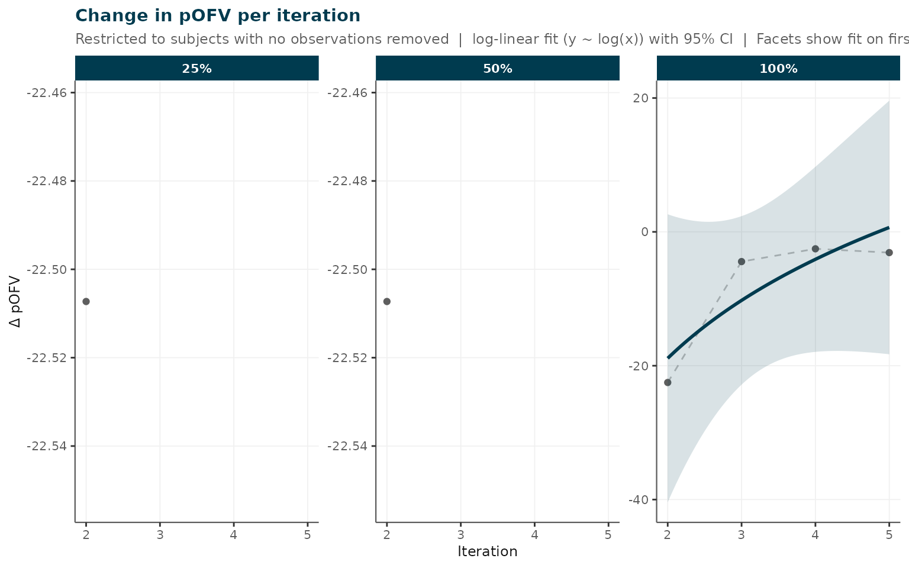

# irxclean Workflow: From Raw Data to Cleaned Dataset

## Overview

`irxclean` provides a structured workflow for detecting and flagging
potentially erroneous pharmacokinetic observations in real-world
clinical datasets. The workflow has two conceptually distinct phases:

**Phase 1 — Pre-model cleaning** (run once, before fitting a base
model):

1.  **Exclusion criteria** – structured logical exclusions: subjects
    with no doses, observations during infusion, dose AMT outliers, etc.
2.  **Gross data quality assessment** – model-independent screening for
    concentration anomalies, covariate outliers, and missing data.

**Phase 2 — Model-informed cleaning** (requires a stable base model):

3.  **Iterative flagging** – CWRES-based detection via NONMEM/PsN,
    producing a ranked list of potentially erroneous observations for
    user review.
4.  **Stability & metrics** – tracking parameter stability across
    iterations.
5.  **Demographic comparison** – checking for demographic bias in
    flagged subjects.

After reviewing flagged observations,
[`remove_observations_from_data()`](https://insightrx.github.io/irxclean/reference/remove_observations_from_data.md)
applies the user-approved exclusions. A single call to
[`generate_report()`](https://insightrx.github.io/irxclean/reference/generate_report.md)
produces a structured HTML summary of findings.

------------------------------------------------------------------------

## 1. Exclusion Criteria

[`apply_exclusion_criteria()`](https://insightrx.github.io/irxclean/reference/apply_exclusion_criteria.md)
applies a configurable battery of structured, model-independent
exclusions. Unlike gross QC (which flags for investigation), these
checks encode logical rules that definitively disqualify records from
analysis.

``` r
dat <- read.csv("my_data.csv")

excl <- apply_exclusion_criteria(
  data                    = dat,
  check_no_doses          = TRUE,   # subjects with no EVID==1 rows
  check_no_tdm            = TRUE,   # subjects with no observation rows
  check_during_infusion   = TRUE,   # obs collected during an ongoing infusion
  check_conc_increase     = TRUE,   # suspicious concentration rises without a dose
  conc_increase_threshold = 1.5,
  check_dose_outlier      = TRUE,   # AMT IQR outlier across dose records
  dose_iqr_multiplier     = 3
)
print(excl)
```

The returned `irxclean_exclusions` object contains:

| Element              | Description                                        |
|----------------------|----------------------------------------------------|
| `$data_flagged`      | Input data with `excl_*` logical columns appended  |
| `$data_clean`        | Rows where no exclusion criterion is TRUE          |
| `$exclusion_summary` | Per-criterion counts (records, subjects, % of obs) |
| `$criteria_applied`  | Character vector of column names added             |

Each criterion adds an `excl_*` column:

| Column                 | Criterion                                      |
|------------------------|------------------------------------------------|
| `excl_no_doses`        | All rows for subjects with no dose records     |
| `excl_no_tdm`          | All rows for subjects with no TDM observations |
| `excl_during_infusion` | Obs rows where `TIME < dose_time + AMT/RATE`   |
| `excl_conc_increase`   | Obs rows with a suspicious concentration rise  |
| `excl_dose_outlier`    | Dose rows with AMT outside IQR bounds          |

You can also pass a named list of row-level logical vectors via
`custom_criteria`:

``` r
# Flag observations with MDV==2 (user-defined exclusion)
excl <- apply_exclusion_criteria(
  dat,
  custom_criteria = list(mdv2 = dat$MDV == 2)
)
```

The cleaned dataset is then passed to the subsequent stages:

``` r
dat_excl <- excl$data_clean
```

------------------------------------------------------------------------

## 2. Gross Data Quality Assessment

After structural exclusions,
[`assess_data_quality()`](https://insightrx.github.io/irxclean/reference/assess_data_quality.md)
performs a rapid model-independent screen for data quality issues. These
checks produce flags for **investigation** — they do not automatically
exclude records.

``` r
qc <- assess_data_quality(
  data                    = dat_excl,
  covariate_cols          = c("AGE", "WT", "HT"),   # continuous covariates
  categorical_cols        = "SEX",                   # categorical covariates
  iqr_multiplier          = 3,                       # IQR x 3 outlier bound
  conc_increase_threshold = 1.5                      # 50\% rise flags as suspicious
)
print(qc)
```

[`assess_data_quality()`](https://insightrx.github.io/irxclean/reference/assess_data_quality.md)
checks for:

| Check                          | Method                                           |
|--------------------------------|--------------------------------------------------|
| Covariate outliers             | Values outside Q1 - k x IQR / Q3 + k x IQR       |
| Concentration TAD-bin outliers | DV outside IQR bounds within each TAD window     |
| Concentration elevations       | Fold-increase \>= threshold, no intervening dose |
| Missing data                   | NA rates per column                              |

``` r
plots <- plot(qc)
plots$missing                    # missing data bar chart
plots$covariate_outliers         # covariate outlier dot plots
plots$concentration_bin_outliers # DV vs TAD scatter with outliers highlighted
plots$conc_flags                 # concentration increase histogram
```

------------------------------------------------------------------------

## 3. Iterative Flagging

The core of `irxclean` is an iterative NONMEM-based detection algorithm.
At each iteration, the observation with the highest absolute CWRES is
identified, flagged, and held out so the model can be re-estimated
without it. This produces a **ranked** list of potentially erroneous
observations. **The analyst must review these results before applying
any exclusions.**

### Requirements

- **PsN** (`execute`, `sumo`) must be on the system `PATH`.
- A NONMEM-ready `.csv` dataset and a `.mod` model file.

### Input modes

[`remove_erroneous_obs()`](https://insightrx.github.io/irxclean/reference/remove_erroneous_obs.md)
accepts inputs in three ways that can be mixed freely:

**Mode 1 — bare file name** (files must be in the current working
directory)

The simplest option when [`setwd()`](https://rdrr.io/r/base/getwd.html)
already points to the project folder. Pass the stem of each filename;
the `.csv` / `.mod` extension is added automatically.

``` r
results <- remove_erroneous_obs(
  dat    = "my_data_excl",   # reads my_data_excl.csv from getwd()
  mod    = "my_model",       # reads my_model.mod from getwd()
  run_id = "clean_run1",
  n      = 10
)
```

**Mode 2 — file path** (relative or absolute, extension optional)

Use this when the data and model live in a different directory from your
R session. The extension is stripped and re-added automatically, so
`"data/pk.csv"` and `"data/pk"` are equivalent.

``` r
results <- remove_erroneous_obs(
  dat    = "/projects/busulfan/data/bu_excl.csv",
  mod    = "/projects/busulfan/models/bu_base",
  run_id = "clean_run1",
  n      = 10
)
```

**Mode 3 — R objects already in memory**

Pass a `data.frame` for `dat` and/or an `nm_model` list (from
[`nm_read_model()`](https://insightrx.github.io/irxclean/reference/nm_read_model.md))
for `mod`. This is the most seamless option when your data has just been
processed in R (e.g. after
[`apply_exclusion_criteria()`](https://insightrx.github.io/irxclean/reference/apply_exclusion_criteria.md)),
or when you want to modify the model programmatically before running.

NONMEM still runs from temporary files on disk —
[`remove_erroneous_obs()`](https://insightrx.github.io/irxclean/reference/remove_erroneous_obs.md)
writes the objects there automatically, so no manual file I/O is needed.

``` r
# Data is already in memory from the exclusion criteria step
pk_clean <- excl$data_clean

# Optionally inspect / modify the model programmatically
nm_mod <- nm_read_model("/projects/busulfan/models/bu_base.mod")
# nm_mod$THETA[1]  <- "(0, 12)"   # tweak a starting value, for example

results <- remove_erroneous_obs(
  dat    = pk_clean,   # data.frame -- no file copy required
  mod    = nm_mod,     # nm_model list -- written to temp dir automatically
  run_id = "clean_run1",
  n      = 10
)
```

You can also **mix modes** — for example, an in-memory data frame with a
file-path model, or vice versa:

``` r
results <- remove_erroneous_obs(
  dat    = excl$data_clean,                        # in-memory data frame
  mod    = "/projects/busulfan/models/bu_base",    # file path
  run_id = "clean_run1",
  n      = 10
)
```

### Common options

``` r
results <- remove_erroneous_obs(
  dat             = "my_data_excl",
  mod             = "my_model",
  run_id          = "clean_run1",
  n               = 10,
  verbose         = TRUE,
  save_results    = TRUE,    # saves to clean_run1_results.RDS
  stability_check = TRUE     # automatically assess parameter stability
)
```

The returned list contains:

| Element        | Description                                                |
|----------------|------------------------------------------------------------|
| `par`          | Population parameter estimates per iteration               |
| `rem`          | Removed observations (ID, TIME, DV, CWRES, ITERATION)      |
| `phi`          | Individual OBJ values per iteration                        |
| `rmse`         | RMSE per iteration                                         |
| `stability`    | Stability assessment (if `stability_check = TRUE`)         |
| `param_labels` | Human-readable parameter names (parsed from .mod comments) |

Results are saved to `<run_id>_results.RDS` and can be reloaded:

``` r
results <- load_removal_results("clean_run1")
```

------------------------------------------------------------------------

## 4. Removal Metrics and Model Stability

### Removal Metrics

[`plot_removal_metrics()`](https://insightrx.github.io/irxclean/reference/plot_removal_metrics.md)
visualises how model-fit statistics evolve as successive observations
are removed. Five metrics are available:

``` r
# Change in pseudo-OFV at each iteration
plot_removal_metrics(results, metric = "pOFV")

# THETA parameter trajectories (normalised to final estimate)
plot_removal_metrics(results, metric = "thetas")

# OMEGA parameter trajectories (diagonal elements)
plot_removal_metrics(results, metric = "omegas")

# SIGMA parameter trajectories (non-fixed diagonal elements; NULL if all fixed)
plot_removal_metrics(results, metric = "sigmas")

# RMSE progression
plot_removal_metrics(results, metric = "rmse")
```

The **pOFV** (pseudo-OFV) is computed only from subjects with **no**
observations removed across all iterations. A sharp drop at early
iterations followed by a plateau suggests meaningful removals with
diminishing returns.

THETA and OMEGA labels are automatically applied when the `.mod` file
contains inline comments in the format `; <index>. <Label>`:

    $THETA
      (0, 11.6)  ; 1. CL
      (0,  9.2)  ; 2. V1
      (0,  0.07) ; 3. prop error

    $SIGMA
      0.0048     ; 1. prop
      800        ; 2. add

When labels contain `prop` / `proportional` / `ruv_prop` or `add` /
`additive` / `ruv_add`, the corresponding parameter is automatically
detected and promoted to the **Key Results** section of the HTML report.

### Model Stability

``` r
stability <- check_model_stability(
  results,
  threshold_pct = 20  # warn if any parameter drifts > 20\% from baseline
)
print(stability)

# View unstable parameters
stability_flag_table(stability)

# Plot parameter drift and RSE
plot(stability)$parameter_drift
plot(stability)$param_rse
```

Each parameter is classified as **stable**, **drifted** (shifted
monotonically to a new value — expected when a genuine outlier is
removed), or **unstable** (bouncing / not settled by the final
iteration).

------------------------------------------------------------------------

## 5. Demographic Comparison

A critical check after iterative removal is whether subjects whose
observations were flagged differ systematically from the rest of the
cohort. Demographic bias in removals could introduce bias into the final
analysis.

``` r
demo <- plot_demographic_comparison(
  data             = dat_excl,
  results          = results,
  continuous_cols  = c("AGE", "WT", "HT", "SCR"),
  categorical_cols = c("SEX", "RACE"),
  id_col           = "ID"
)

# Statistical test results
print(demo$stats)

# Individual covariate plots
demo$panels[[1]]
```

------------------------------------------------------------------------

## 6. Producing a Cleaned Dataset

After reviewing the ranked flagged observations—including stability
metrics, demographic comparisons, and any additional clinical or
laboratory investigation—decide how many (if any) to exclude. A flagged
observation is not necessarily erroneous: it may represent a genuine
patient subgroup or an unusual but valid measurement.

``` r
dat_clean <- remove_observations_from_data(
  data    = dat_excl,
  results = results,
  n       = 5,   # remove only the first 5 iterations
  columns = list(ID = "ID", TIME = "TIME", DV = "DV")
)
write.csv(dat_clean, "my_data_clean.csv", row.names = FALSE)
```

------------------------------------------------------------------------

## 7. Automated Report

All iterative-removal findings can be compiled into a structured,
self-contained HTML report. The report has two sections:

- **Key Results** (always visible): removed observations table, pOFV
  change, proportional/additive error parameter stability (auto-detected
  from labels), and nRMSE trend.
- **Detailed Results** (collapsible): full THETA, OMEGA, and SIGMA
  stability facet plots, plus model stability assessment.

``` r
generate_report(
  results              = results,
  data                 = dat_excl,
  # prop_error_param / add_error_param auto-detected from results$param_labels
  # override explicitly if needed:
  prop_error_param     = "THETA7",
  add_error_param      = "SIGMA.1.1",
  continuous_cov_cols  = c("AGE", "WT", "HT"),
  categorical_cov_cols = "SEX",
  title                = "Busulfan PK -- Cleaning Analysis",
  output_file          = "busulfan_cleaning_report.html"
)
```

> **Note:** `quality_results` from
> [`assess_data_quality()`](https://insightrx.github.io/irxclean/reference/assess_data_quality.md)
> is no longer passed to
> [`generate_report()`](https://insightrx.github.io/irxclean/reference/generate_report.md).
> Gross QC findings are documented separately (e.g. by printing or
> plotting the `irxclean_quality` object) before the base model is
> fitted.

------------------------------------------------------------------------

## Example: Using Pre-Computed Results

The package ships with a pre-computed results file from a busulfan PK
dataset so you can explore the API without needing NONMEM:

``` r
rds <- system.file("extdata", "busulfan_results.RDS", package = "irxclean")
results <- readRDS(rds)

# pOFV plot
plot_removal_metrics(results, metric = "pOFV", verbose = FALSE)
```



``` r
stability <- check_model_stability(results, threshold_pct = 20, verbose = FALSE)
print(stability)
#> irxclean model stability (threshold: 20%)
#>   stable     : 4 parameter(s)
#>   drifted    : 3 parameter(s)
#>   unstable   : 10 parameter(s)
#> 
#> Parameter summary:
#>        PARAMETER RSE_PCT N_REVERSALS CV_LATE_PCT DRIFT_PCT   STATUS
#>            TH_CL   37.32          12       8.065  5.08e+01  drifted
#>             TH_V   34.43          10       0.326  1.92e+01  drifted
#>          MAT-MAG 7870.87           9      16.079  1.36e+01 unstable
#>            K_MAT   37.68           7       3.686  5.21e+00   stable
#>       PROP error    6.10           4       0.797  1.97e+01  drifted
#>        ADD error   78.03          11       0.270  4.77e-01 unstable
#>             DROP   88.68          12      13.318  5.86e+02 unstable
#>            SHAPE  443.64          10      15.904  1.07e+04 unstable
#>     allo ffm exp    4.61           8       0.984  6.59e+00   stable
#>  Sex effect on V    1.27          11       0.149  2.02e+00   stable
#>                Q  119.05           8       4.428  7.14e+01 unstable
#>               V2   98.14          10       2.221  5.37e+01 unstable
#>           IIV CL    9.84           9       0.268  1.96e+00   stable
#>           IIV V1  137.25          10       0.721  2.30e+01 unstable
#>           IOV CL  135.55           9       0.000  9.78e+01 unstable
#>           IOV V1  370.66           3       0.000  0.00e+00 unstable
#>           IIV V2   28.55           9      10.694  3.16e+01 unstable
#> 
#> nRMSE trend: decreasing
```

------------------------------------------------------------------------

## Planned Extensions

Future versions of `irxclean` will expand support to:

- **PharmPy** – Python-based NONMEM interface
- **PsN** additional tools (e.g. `sse`, `vpc` integration)
- **nlmixr2** – R-native NLME estimation engine
- Additional removal criteria beyond CWRES (e.g. iOFV, individual NPDE)
